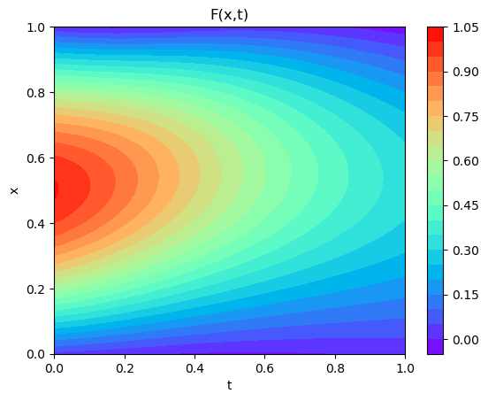
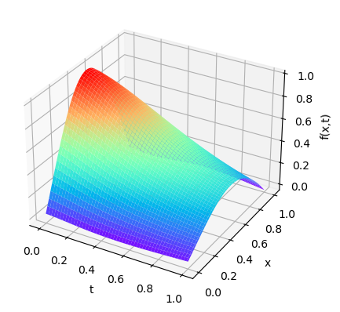

---

#🔰 Simulation de la difusion de chaleur avec les  Réseaux de Neuronesinformé par la physique (Pinns).

Ce projet est mon projet tutoré lor de ma troisième année en Génie Mathématique et Modélisation à l'ENSGMM.
Ic on implémente un réseau de neurones profond informé par la physique  pour résoudre une équation différentielle partielle (PDE) de la diffussion de chaleur  à l'aide de la méthode des réseaux de neurones basés sur la physique (Physics-Informed Neural Networks - PINNs). Nous utilisons PyTorch pour l'entraînement et la résolution  et inclut les méthodes d'optimisation  Adam et L-BFGS pour la minimisation de la perte.

## Installation :

```bash
pip install torch matplotlib scikit-learn pyDOE scipy
```

## Structure du projet

Voici les principaux fichiers du projet :

- **Chaleur_pinns.ipynb** [ici](https://github.com/GOHOUEDE/Difffusion-de-chaleur-avec-Pinns/blob/main/Chaleur_pinns.ipynb) : Le notebook qui présente le travail(code ,chargement et graphiques).
- **code.py** [ici](https://github.com/GOHOUEDE/Difffusion-de-chaleur-avec-Pinns/blob/main/Code.py) : Contient l'intégralité des codes python pour la simulation de la difussion de chaleur.
- **README.md** : Documentation du projet.

  
## Description du modèle

Le modèle utilise un réseau de neurones fully connected (FCN) pour approximer la solution de l'equation de difusion. Le réseau est entraîné à l'aide de données de conditions aux limites et de points de collocation générés de manière aléatoire à l'aide de l'échantillonnage hypercube latin.

Voici les étape:

1. **Conditions aux limites (BC)** : Le modèle est entraîné pour satisfaire les conditions aux limites définies sur les bords du domaine.
2. **Équation différentielle partielle (PDE)** : La perte est calculée en fonction de la satisfaction de l'EDP à l'intérieur du domaine en utilisant la dérivée de la solution par rapport aux variables spatiales et temporelles.

## Variables et Hyperparamètres

- **steps** : Le nombre d'itérations d'entraînement.
- **lr** : Le taux d'apprentissage pour l'optimisation.
- **layers** : La structure du réseau de neurones (par exemple, [2, 32, 32, 1] pour un réseau avec 2 entrées, deux couches cachées de 32 neurones et une sortie).
- **Nu** : Le nombre de points d'entraînement issus des conditions aux limites.
- **Nf** : Le nombre de points de collocation pour l'EDP.
- **x_min, x_max, t_min, t_max** : Les bornes spatiales et temporelles pour la simulation.
  
## Utilisation

1. **Préparation des données** : On génere des données d'entrée à partir de points uniformément espacés dans un domaine défini.
2. **Entraînement du modèle** : Le réseau de neurones est formé sur les données de conditions aux limites et les points de collocation pour minimiser la fonction  perte.
3. **Visualisation** : Nous avons tracé en 3D à l'aide de Matplotlib les résultats pour observer l'évolution de la solution dans le domaine spatial et temporel.


## Résultats

Le réseau de neurones artificiels supposé comporte 4 couches cachées avec respectivement 2, 32, 32 et 1 neurones. Il est entraîné sur 20 000 étapes avec un taux d'apprentissage de \(1 \times 10^{-3}\). 

Pour générer de nouvelles données, nous définissons une plage de valeurs pour \(x\) de 0 à 1 et pour \(t\) de 0 à 1, avec respectivement 200 et 100 points. Nous utilisons 100 points pour l’entraînement (\(Nu\)) et 10 000 points pour l’évaluation de l’équation aux dérivées partielles (\(Nf\)).

## Solution Analytique
Pour commencer, nous avons tracé notre solution analytique, voici les figures obtenues :

- **Figures**: Solution analytique du modèle (image 1D et 2D)
  
-   


## 7.1 Réseau Entraîné avec la Perte MSEu

On peut constater que le réseau a appris les \(Nu\) données expérimentales et conditions initiales et respecte donc les conditions initiales et limites, mais n’a pas pu apprendre le phénomène (l’EDP). De même, une différence maximale de 0.09 est observée. Les valeurs prédites sont proches des réelles.

- **Figure 6**: Modèle entraîné avec la perte MSEu seule (Plan  1D et 2D)
 - 
 - 

## 7.2 Réseau Entraîné avec la Perte MSEf

Contrairement au cas précédent, on peut constater que le réseau a appris l’EDP, mais cette fois-ci, il n'a pas appris les conditions initiales et limites. Une différence maximale de 0.09 est également observée. Les valeurs prédites sont proches des réelles.
  
- **Figure 8**: Modèle entraîné avec la perte MSEf seule (Plan 1D)
  
- **Figure 9**: Modèle entraîné avec la perte MSEf seule (Plan 2D)

## 7.3 Réseau PINN

Maintenant, nous entraînons notre réseau PINN avec une perte égale à la somme des deux autres. Il est évident que le réseau apprend à la fois l’EDP et les conditions initiales et limites.
 
- **Figure 10**: Solution analytique du modèle (image 1D)
 
- **Figure 11**: Solution analytique du modèle (image 2D)

## Comparaison MSE

- On peut constater une simulation du phénomène proche du réel.
  -
- Ici la diréfence entre valeur réelles et valeurs prédictes:
 -


